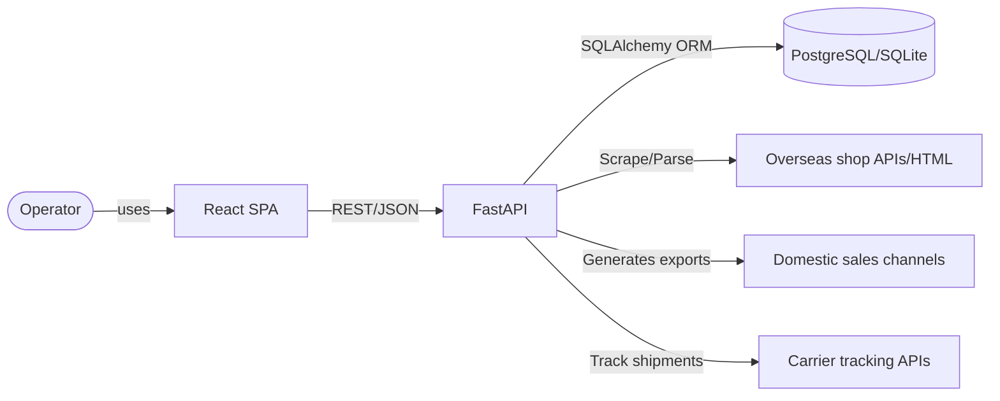
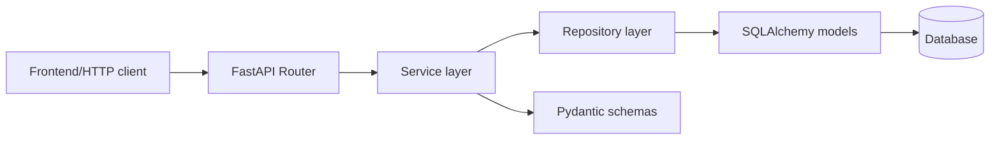
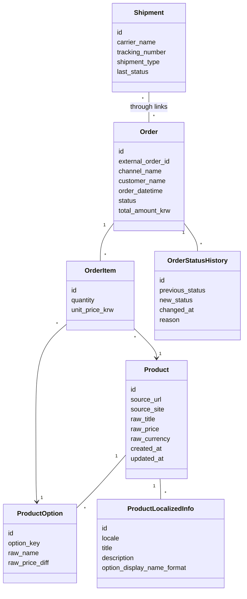
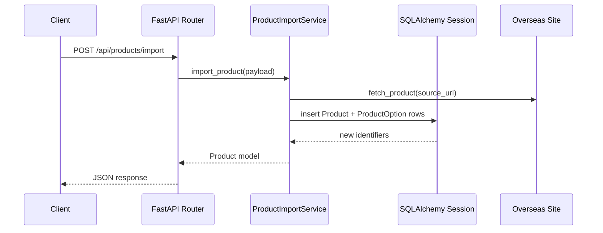

# QQQ Purchase Agency Assistant Architecture

## Technical Stack Proposal
- **Backend**: FastAPI (Python 3.11), Uvicorn for ASGI server
- **ORM**: SQLAlchemy 2.x with Alembic for migrations; Pydantic v2 for schemas
- **Database**: PostgreSQL (development can use SQLite); connection via SQLAlchemy
- **Authentication**: Simple session/JWT placeholder (single-operator ready)
- **Task/Background Jobs**: FastAPI background tasks (future: Celery/RQ)
- **Frontend**: React 18 with TypeScript, Vite build tool, React Query for data fetching, React Router for page navigation, Tailwind CSS for utility styling
- **API Contract**: RESTful JSON over HTTP; file uploads for spreadsheets
- **Packaging**: `pyproject.toml` using `uvicorn[standard]`, `fastapi`, `sqlalchemy`, `alembic`, `pydantic` dependencies; frontend `package.json` with Vite/React/TypeScript/Tailwind

## Core Domain Entities
- Product, ProductOption, ProductLocalizedInfo
- SalesChannelTemplate
- Order, OrderItem, Shipment, OrderShipmentLink, OrderStatusHistory

## REST API Design (initial draft)
### Product Ingestion & Localization
- `POST /api/products:import` — body: `{ source_url, source_site }`; triggers scrape/parse and stores Product. Returns Product with parsed options.
- `GET /api/products` — list products with filters (source_site, keyword, date range).
- `GET /api/products/{product_id}` — retrieve product + options + localization.
- `PUT /api/products/{product_id}/localization` — save ProductLocalizedInfo (title, description, option display format, locale).
- `PUT /api/products/{product_id}/options/{option_id}` — edit option names/prices.

### Sales Channel Export
- `POST /api/exports/channel/{channel_name}` — body: `{ product_ids: [], template_type }`; returns generated file metadata & presigned download URL placeholder.

### Orders & Procurement
- `POST /api/orders:upload` — multipart/form-data with file; parses spreadsheet into Orders & OrderItems.
- `GET /api/orders` — list orders with status filters.
- `GET /api/orders/{order_id}` — detailed order, items, shipments, history.
- `PUT /api/orders/{order_id}/status` — body: `{ new_status, reason }`; appends OrderStatusHistory.
- `POST /api/purchase-orders` — aggregate Orders by product/option where status = `NEW`; returns procurement list and saves snapshot.

### Shipments
- `POST /api/shipments` — body: `{ carrier_name, tracking_number, shipment_type, linked_order_ids: [] }`.
- `GET /api/shipments` — list shipments with latest status.
- `PUT /api/shipments/{shipment_id}` — update tracking or status (manual override).

### Customer Templates
- `POST /api/templates/messages` — body: `{ order_id, template_type }`; responds with generated message text.

### Reporting
- `GET /api/reports/sales` — query params: date range, channel; returns totals, counts.
- `GET /api/reports/products` — top products/quantities.
- `GET /api/reports/cancellations` — refund/cancel ratios.

## Frontend Page Map
- `/products` — product list & detail preview; button to add new URL.
- `/products/import` — form to submit overseas URL.
- `/orders/upload` — upload order spreadsheet; show parse summary.
- `/orders` — order list with status filters; detail drawer with shipments & history.
- `/shipments` — list/create shipment tracking links.

## Folder Layout (initial)
```
backend/
  app/
    api/          # FastAPI routers
    models/       # SQLAlchemy models
    schemas/      # Pydantic schemas
    repositories/ # Data access layer
    services/     # Business logic (parsing, localization, exports)
    main.py       # FastAPI app factory
    database.py   # DB session + engine
frontend/
  src/
    pages/        # React pages
    components/   # Shared UI widgets
  index.html
  package.json
  vite.config.ts
  tsconfig.json
```

## Architecture Diagrams

### System Context


### Backend Layering (per request)


### Domain Entities (simplified)


### Main Request Flow (Product Import)

